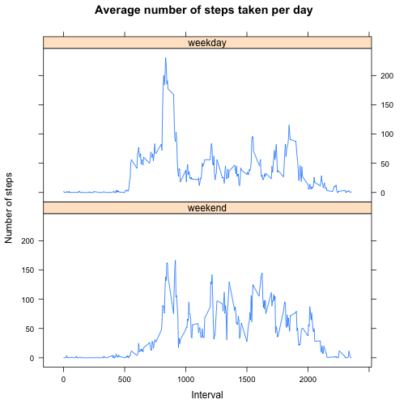

# Report of the activity monitoring


## Loading and preprocessing the data


```r
# Load the activity dataset
activity <- read.csv("data/activity.csv")

# Format the date column properly
activity$date <- as.Date(activity$date, format="%Y-%m-%d")
```


## Mean total number of steps taken per day

The total number of steps taken per day is obtained by grouping the steps by day
and applying a sum excluding the missing values:


```r
steps_per_day <- aggregate(steps ~ date, data=activity, sum, na.rm=TRUE)
hist(steps_per_day$steps, xlab="Number of steps", breaks=10, 
     col="seagreen", main="Total number of steps taken each day")
```

 

The mean and the median of the total number of steps per day:


```r
mean_steps_per_day <- mean(steps_per_day$steps)
median_steps_per_day <- median(steps_per_day$steps)
```

* Mean: 10766.19
* Median: 10765.00


## Average daily activity pattern


```r
avg_daily_steps <- aggregate(steps ~ interval, data=activity, mean, na.rm = T)
plot(avg_daily_steps, type="l", main="Average daily steps", 
     ylab="Number of steps", xlab="5-minute intervals")
```

 

```r
max_steps <- subset(avg_daily_steps, steps == max(avg_daily_steps$steps))
```

The maximum number of steps (206.1698), on average accross all the days in the dataset occurs in the interval 835.


## Imputing missing values


```r
missing_values <- subset(activity, is.na(steps))
nb_missing_values <- nrow(missing_values)
```

There are 2304 missing values in the dataset.

The strategy for imputing missing values:

* Merge the original data with the average daily activity 
* Replace these missing values in the original dataset with the average daily step
  at the corresponding interval


```r
# Merge
activity_new <- merge(activity, avg_daily_steps, by="interval")

# Reorder by date and interval
activity_new <- activity_new[order(activity_new$date, activity_new$interval),]

# Replace the missing values with the daily average values
activity_new[is.na(activity_new$steps.x),]$steps.x <- activity_new[is.na(activity_new$steps.x),]$steps.y

# Rename the column steps.x to steps
names(activity_new)[2] <- "steps"

# Remove the steps.y column
activity_new <- activity_new[, c("interval", "steps", "date")]
```

The histogram of the total number of steps taken each day is now:


```r
steps_per_day_new <- aggregate(steps ~ date, data=activity_new, sum)
hist(steps_per_day_new$steps, xlab="Number of steps", breaks=10, 
     col="seagreen", main="Total number of steps taken each day")
```

 


The mean and the median of the total number of steps per day after imputing the 
missing values:


```r
mean_steps_per_day_new <- mean(steps_per_day_new$steps)
median_steps_per_day_new <- median(steps_per_day_new$steps)
```

* Mean: 10766.19
* Median: 10766.19

These results show that, after the imputation, only the median value differs from the original estimation. It is now equal to mean value.
Imputing missing data with the mean values of the average daily data allowed to prevent the loss of information and preserve the mean total
number of steps taken per day. 


## Differences in activity patterns between weekdays and weekends

The week days of the date column in the dataset are deduced with the `weekdays`
function and created as a factor that is then added as a new column:


```r
fdays <- factor(weekdays(activity_new$date))
levels(fdays)[levels(fdays) %in% c("Dimanche", "Samedi")] = "weekend" 
levels(fdays)[!(levels(fdays) %in% "weekend")] = "weekday" 

activity_new$day <- fdays
```


```r
library(lattice)
avg_activity2 <- aggregate(steps ~ interval + day, data=activity_new, mean)
xyplot(steps ~ interval | day, data=avg_activity2, type="l", layout = c(1, 2),
       xlab="Interval", ylab="Number of steps", main="Average number of steps taken per day")
```

 
