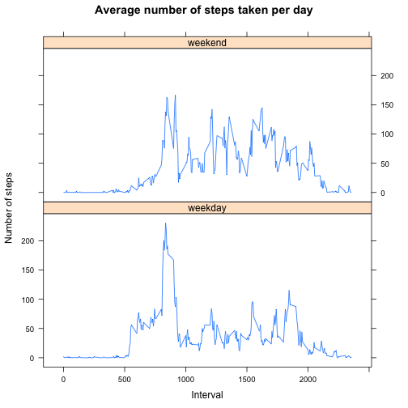

# Activity monitoring data report


**Author:** Taurus Olson  
**Date:** 16th October 2014


## Loading and preprocessing the data

We load the `Activity monitoring` dataset and format the `date` column properly.


```r
activity <- read.csv("data/activity.csv")
activity$date <- as.Date(activity$date, format="%Y-%m-%d")
```


## Mean total number of steps taken per day

The total number of steps taken per day is obtained by grouping the steps by
day and applying a sum excluding the missing values. The corresponding histogram 
is shown below:


```r
steps_per_day <- aggregate(steps ~ date, data=activity, sum, na.rm=TRUE)
h <- hist(steps_per_day$steps, xlab="Number of steps", breaks=10, 
     col="seagreen", main="Total number of steps taken each day")
```

 

The mean and the median of the total number of steps per day:


```r
mean_steps_per_day <- mean(steps_per_day$steps)
median_steps_per_day <- median(steps_per_day$steps)
```

* Mean: 10766.19
* Median: 10765.00


## Average daily activity pattern

The average daily activiy pattern is obtained by grouping the steps by the
5-minute intervals and applying a mean excluding the missing values. The corresponding
time series is shown below:


```r
avg_daily_steps <- aggregate(steps ~ interval, data=activity, mean, na.rm = TRUE)
plot(avg_daily_steps, type="l", main="Average daily steps", 
     ylab="Number of steps", xlab="5-minute intervals")
```

 


```r
max_steps <- subset(avg_daily_steps, steps == max(avg_daily_steps$steps))
```

The maximum number of steps (206.1698), on average accross all the
days in the dataset occurs in the interval 835.


## Imputing missing values

Here is code allowing to count the number of missing values in the dataset (coded as `NA`):


```r
nb_missing_values <- nrow(subset(activity, is.na(steps)))
```

There are 2304 missing values.

The strategy for imputing missing values:

* Merge the original data with the average daily activity 
* Replace these missing values in the original dataset with the average daily step
  at the corresponding interval


```r
# Merge
activity_new <- merge(activity, avg_daily_steps, by="interval")

# Reorder by date and interval
activity_new <- activity_new[order(activity_new$date, activity_new$interval),]

# Replace the missing values with the daily average values
activity_new[is.na(activity_new$steps.x),]$steps.x <- activity_new[is.na(activity_new$steps.x),]$steps.y

# Rename the column steps.x to steps
names(activity_new)[2] <- "steps"

# Remove the steps.y column
activity_new <- activity_new[, c("interval", "steps", "date")]
```

The histogram of the total number of steps taken each day after the imputation is:


```r
steps_per_day_new <- aggregate(steps ~ date, data=activity_new, sum)
h_new <- hist(steps_per_day_new$steps, xlab="Number of steps", breaks=10, 
     col="seagreen", main="Total number of steps taken each day")
```

 

The mean and the median of the total number of steps per day after imputing the 
missing values:


```r
mean_steps_per_day_new <- mean(steps_per_day_new$steps)
median_steps_per_day_new <- median(steps_per_day_new$steps)
```

* Mean: 10766.19
* Median: 10766.19

These results show that, after the imputation, only the median value differs
from the original estimation. It is now equal to mean value.  

The following table shows a comparison of the counts of the number of
steps per day before and after the imputation:


```r
nb_steps <- data.frame(steps=h$mids, count_before=h$counts, count_after=h_new$counts)
library(xtable)
print(xtable(nb_steps), type="html")
```

<!-- html table generated in R 3.1.1 by xtable 1.7-3 package -->
<!-- Sun Oct 19 17:15:30 2014 -->
<TABLE border=1>
<TR> <TH>  </TH> <TH> steps </TH> <TH> count_before </TH> <TH> count_after </TH>  </TR>
  <TR> <TD align="right"> 1 </TD> <TD align="right"> 1000.00 </TD> <TD align="right">   2 </TD> <TD align="right">   2 </TD> </TR>
  <TR> <TD align="right"> 2 </TD> <TD align="right"> 3000.00 </TD> <TD align="right">   2 </TD> <TD align="right">   2 </TD> </TR>
  <TR> <TD align="right"> 3 </TD> <TD align="right"> 5000.00 </TD> <TD align="right">   3 </TD> <TD align="right">   3 </TD> </TR>
  <TR> <TD align="right"> 4 </TD> <TD align="right"> 7000.00 </TD> <TD align="right">   3 </TD> <TD align="right">   3 </TD> </TR>
  <TR> <TD align="right"> 5 </TD> <TD align="right"> 9000.00 </TD> <TD align="right">   7 </TD> <TD align="right">   7 </TD> </TR>
  <TR> <TD align="right"> 6 </TD> <TD align="right"> 11000.00 </TD> <TD align="right">  16 </TD> <TD align="right">  24 </TD> </TR>
  <TR> <TD align="right"> 7 </TD> <TD align="right"> 13000.00 </TD> <TD align="right">  10 </TD> <TD align="right">  10 </TD> </TR>
  <TR> <TD align="right"> 8 </TD> <TD align="right"> 15000.00 </TD> <TD align="right">   7 </TD> <TD align="right">   7 </TD> </TR>
  <TR> <TD align="right"> 9 </TD> <TD align="right"> 17000.00 </TD> <TD align="right">   1 </TD> <TD align="right">   1 </TD> </TR>
  <TR> <TD align="right"> 10 </TD> <TD align="right"> 19000.00 </TD> <TD align="right">   0 </TD> <TD align="right">   0 </TD> </TR>
  <TR> <TD align="right"> 11 </TD> <TD align="right"> 21000.00 </TD> <TD align="right">   2 </TD> <TD align="right">   2 </TD> </TR>
   </TABLE>

The result shows that the count after the imputation increased of 50% for the value
11000 steps (which is roughly the mean value of the total number of steps per day.)

Imputing missing data with the mean values of the average daily data allowed to
prevent the loss of information and preserve the mean total number of steps
taken per day. 


## Differences in activity patterns between weekdays and weekends

The week days of the date column in the dataset are deduced with the `weekdays`
function and created as a factor that is then added as a new column.


```r
fdays <- factor(weekdays(activity_new$date))

# Weekends are designated by 'weekend'
levels(fdays)[levels(fdays) %in% c("Sunday", "Saturday")] = "weekend" 

# Weekdays are designated by 'weekday'
levels(fdays)[!(levels(fdays) %in% "weekend")] = "weekday" 

activity_new$days <- fdays
```

The average number of steps averaged across all weekday days or weekend days is
obtained by grouping the steps by 5-minute interval and days, then applying the
mean. The corresponding time sries is shown below:


```r
avg_daily_steps_by_days <- aggregate(steps ~ interval + days, data=activity_new, mean)

library(lattice)
xyplot(steps ~ interval | days, data=avg_daily_steps_by_days, type="l", layout = c(1, 2),
       xlab="Interval", ylab="Number of steps", main="Average number of steps taken per day")
```

 

